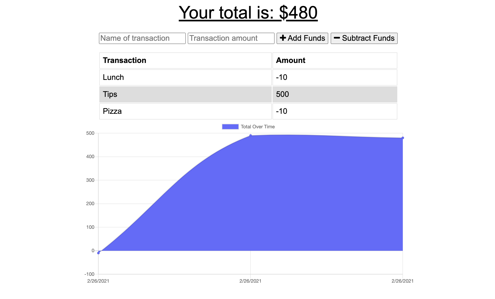
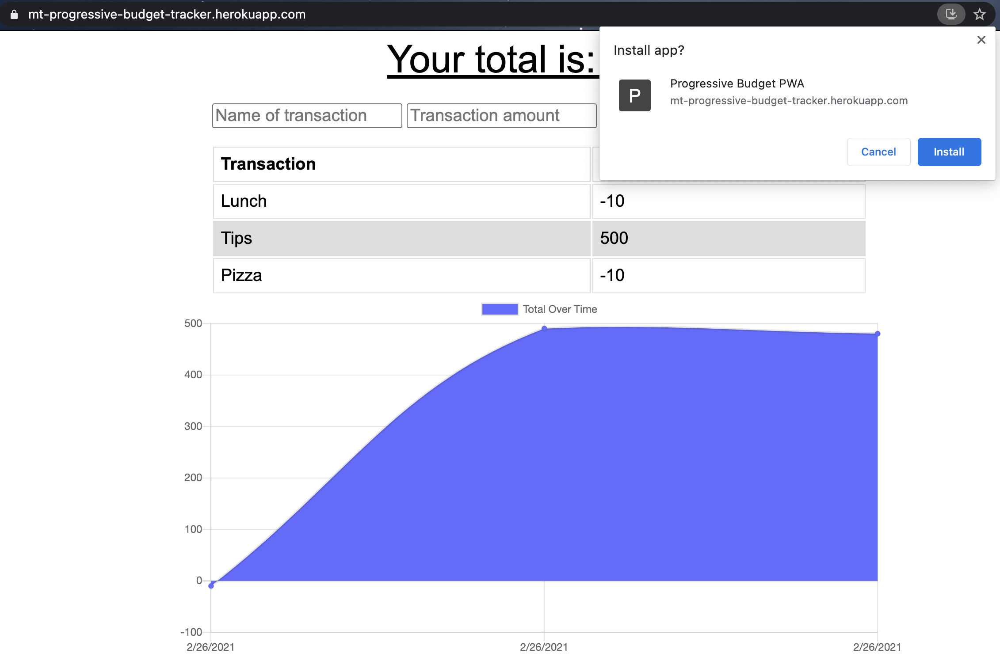

# PWA Budget Tracker

 

A Budget Tracker application that allows users to add expenses and deposits to their budget with or without a connection. When entering transactions offline, they should populate the total when brought back online.

## Table of Contents

* [Installation](#installation)
* [Usage](#usage)
* [Links](#Links)
* [Features](#Features)
* [License](#License)

## Installation

1. Download or clone repository
2. `npm install` to install the required npm packages to run

## Usage

* Application will be invoked by using the following command:

  `node server.js`

* Open your browser and go to
  
  `http://localhost:3000`

* User can add transactions as deposits or expenses by inputting the following:
  * Name of transaction
  * Transaction amount
  * For deposits - select **Add Funds**
  * For expenses - select **Subtract Funds**

* The total amount is reflected as soon as funds are entered

* The graph portrays the total funds over time by date entered for each transaction

  

* The app can be used online and offline

* Offline Functionality:
  * Enter deposits offline
  * Enter expenses offline

* When brought back online:
  * Offline entries should be added to tracker

* There is also the option to download the app

  

## Links

* [Github](https://github.com/mmeii/progressive-budget-tracker)
* [Live Heroku App](https://mt-progressive-budget-tracker.herokuapp.com/)

## Features

* Node
* Express
* JavaScript
* MongoDB
* Mongoose
* Progressive Web Application

## License

  Copyright (c) Mengmei Tu. All rights reserved.
  
  Licensed under the [MIT](LICENSE) license.
  